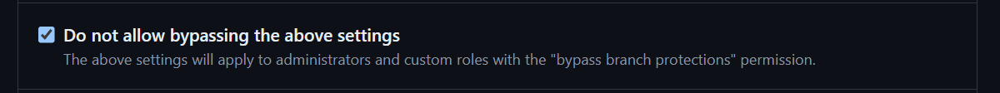

[Volver - Main](https://github.com/IngSoft-DA2/DA2-Tecnologia)

# Configuracion del repo

A continuacion se pueden encontrar aquellos archivos que son requeridos en la solucion junto con una breve descripcion de su funcionalidad dentro del repositorio y de la solucion.

## Archivos

- **[.gitignore](https://github.com/daniel18acevedo/DA2-Tecnologia/blob/repo-configuration/.gitignore)**: Este archivo es para ignorar aquellos archivos que no se quiere tener un control de version. Esto quiere decir, que ciertos archivos por mas que sean modificados, eliminados o agregados, no se vera ningun cambio efectuado en el historico de cambios de git al momento de crear un commit. Para que este archivo haga efecto, tiene que ser controlado primero por git antes de aquellos archivos que queremos ignorar. En caso de agregar este archivo posteriormente al repo y los archivos que queremos ignorar ya estan siendo trackeados por git, estos deberan de ser eliminados, commitear la eliminacion de los mismos y luego cuando vuelvan a ser agregados estos ya no se veran en el historico de cambios. La eliminacion de los archivos y el commit hacen que git deje de trackear los cambios en esos archivos para que pueda tener efecto el gitignore.

- **[.editorconfig](https://github.com/daniel18acevedo/DA2-Tecnologia/blob/repo-configuration/.editorconfig)**: Configuracion de reglas de clean code para C#.

- **[Directory.Build.props](https://github.com/daniel18acevedo/DA2-Tecnologia/blob/repo-configuration/Directory.Build.props)**: Archivo donde se especifican aquellos paquetes junto con sus versiones que son usados por todos los proyectos locales de la solucion. Es una forma mas rapida de controlar sus versiones y que los paquetes locales se actualicen en simultaneo. Es muy util este archivo para tener centralizado aquellas dependencias transversales que impactan a todos los proyectos de la solucion.

- **[pull_request_template.md](https://github.com/daniel18acevedo/DA2-Tecnologia/blob/repo-configuration/pull_request_template.md)**: Es una guia sobre la informacion a incluir en los pull request que se creen. La misma se debera de modificar en las partes necesarias para agregar informacion sobre el PR del trabajo realizado.

- **[.github/workflows/build-and-test.yml](https://github.com/daniel18acevedo/DA2-Tecnologia/blob/repo-configuration/.github/workflows/build-and-test.yml)**: Es una configuracion para ejecutar tareas al momento de realizar ciertas acciones en github. Esta configurado para que haga build y corra las pruebas junto con el chequeo de cobertura del codigo, cuando se crea un PR y cuando se mergea codigo a una rama.

- **[.github/workflows/code-analysis.yml](https://github.com/daniel18acevedo/DA2-Tecnologia/blob/repo-configuration/.github/workflows/code-analysis.yml)**: Es una configuracion que analiza el codigo en funcion a los parametros del archivo **.editorconfig**.

  - Estos dos ultimos archivos para que tengan efecto, se tienen que encontrar dentro de la carpeta `workflows` y esta dentro de la carpeta `.github`.

- **[.gitattributes](https://github.com/daniel18acevedo/DA2-Tecnologia/blob/repo-configuration/.gitattributes)**: Este archivo de configuracion permite asignarle atributos a otros archivos y directorios en el proyecto, para poder indicarle a Git como debe tratarlos.

# Badges

Las badges son elementos que nos permiten visualizar rapidamente el estado del repositorio. Estos nos van a servir para ver rapidamente si las pruebas estan pasando o fallando y si se esta respetando clean code sin la necesidad de inspeccionar en profundidad el repositorio y/o el codigo.

```md

```

```md

```

<p align="center">
  [Badge de build y test]
</p>


```md

```

```md

```
<p align="center">
  [Badge de clean code]
</p>

Dichos badges, se tienen que pegar en el `Readme.md` del repositorio y se debe cambiar `https://github.com/daniel18acevedo/style-analysis` por el link del repositorio.

# Configuracion de branches

Se requiere que configuren reglas en las branches principales para evitar conflictos al momento de mergear.

- Ir a Settings (Ultima opcion en la barra de navegacion en github en el repositorio)
<p align="center">

</p>

## General

- Ir a General
<p align="center">

</p>

- La branch por defecto debera ser una rama con el nombre `develop`. El nombre de la branch indica el ambiente en el cual esta el codigo, la branch `develop` es el ambiente de desarrollo, por eso es que debe ser la `default` branch ya que es a la que se estara mergeando y actualizando constantemente. La branch `main` es para el ambiente de produccion, a esta rama no se le suele mergear codigo tan seguidamente como a `develop`. Esta rama se vera actualizada unicamente los dias de las entregas y solamente puede ser actualizada desde `develop`.

<p align="center">

</p>

- Seccion `Feature`. Desmarcar todos los check-box excepto por el ultimo.

<p align="center">

</p>

- Configurar la seccion de `Pull Requests` de la siguiente manera
<p align="center">

</p>

## Branches

- Ir a Branches
<p align="center">

</p>

- Crear una nueva regla, seleccionar la opcion `Add classic branch protection rule`.
<p align="center">

</p>

- En el nombre de la rama poner: `[main,develop]*`

- Seleccionar la opcion `Require a pull request before merging`
<p align="center">

</p>

- Seleccionar `Require status checks to pass before merging` y poner `Build`, `Test` y `Analysis`. Para que aparezcan estas opciones, previamente se tuvieron que agregar los `github-actions`.

<p align="center">

</p>

- Seleccionar `Do not allow bypassing the above settings`

<p align="center">

</p>

- Para terminar apretar `Create`

  # Link de la clase
  [M6-ID - Al final](https://ortuy.hosted.panopto.com/Panopto/Pages/Viewer.aspx?id=8c10290e-53f2-4a9f-95ad-b1e000bb2e18)
  
  [N5-AN](https://vimeopro.com/universidadortfi/fi-6343-diseno-de-aplicaciones-2-70276-d2-n5a-an/video/1001858328)
