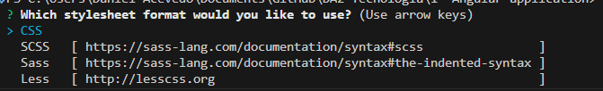
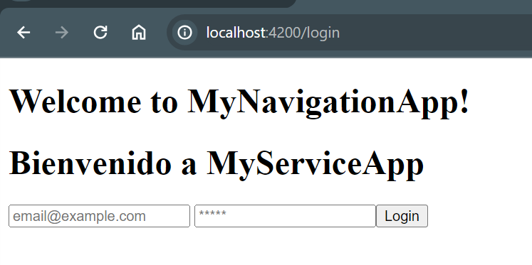
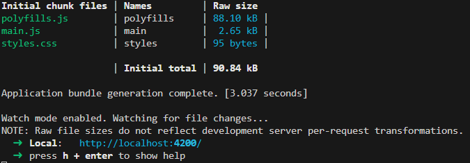
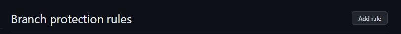
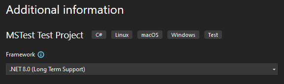

[Atras - Indice](https://github.com/daniel18acevedo/DA2-Tecnologia/blob/angular/angular-style)

# Bootstrap

Bootstrap es una herramienta poderosa, extensible que contiene elementos de frontend. Esta hecha y customizada con Sass, utiliza un sistema de componentes grid y usa JavaScripts para algunas acciones.

Bootstrap es una libreria que define clases CSS que podremos utilizar en elementos HTML y poder dar vida a los componentes.

## Instalacion

Para instalar bootstrap debemos ejecutar el siguiente comando dentro de la carpeta de la aplicacion:

```CMD
npm install bootstrap
```

Una vez que termine podemos corroborar que este instalado al ver la declaracion de la dependencia en `package.json`:

<p align="center">

</p>

<p align="center">
[package.json con bootstrap]
</p>

Una vez instalado, debemos integrarlo en la aplicacion, para ello debemos de modificar `angular.json`.

En la property array `architect.build.options.styles`, debemos de agregar lo siguiente:

```
"node_modules/bootstrap/dist/css/bootstrap.min.css"
```

Teniendo como resultado:

<p align="center">

</p>

<p align="center">
[angular.json con bootstrap]
</p>

Lo que logramos fue integrar todos los estilos compilados definidos en bootstrap a disposicion de cualquier componente en la aplicacion.

Algunos elementos definidos en bootstrap, hacen uso de funcions JavaScript, para que nos funcione correctamente, necesitamos instalar `JQuery`. Para instalar `JQuery` debemos correr lo siguiente:

```CMD
npm install jquery
```

<p align="center">

</p>

<p align="center">
[package.json con jquery]
</p>

Nuevamente debemos modificar `angular.json` para integrar `JQuery` en la aplicacion. En la property array `architect.build.options.scripts` debemos agregar:

```
"node_modules/jquery/dist/jquery.min.js" y "node_modules/jquery/dist/jquery.min.js"
```

Teniendo como resultado:

<p align="center">

</p>

<p align="center">
[angular.json con jquery]
</p>

Una vez que tenemos instalado e importado `bootstrap` y `jquery` podremos usar las clases de estilado en nuestra aplicacion.

## Modificando el componente button para usar bootstrap

Procedermos a actualizar el estilaod del componente `button` para que se vea de la siguiente manera:

<p align="center">

</p>

<p align="center">
[Estilo de boton por defecto]
</p>

Para ello debemos modificar `button.component.html` de la siguiente manera:

```HTML
<button class="btn btn-dark" (click)="onClick()">
  {{ title }}
</button>
```

El cual aplicara dichas clases al componente y su visualizacion debe ser la documentada en `bootstrap`.

Definamos un nuevo input al componente que sea `color` para dar la flexibilidad de cambiar el color de fondo del boton.

Dejando `button.component.ts` de la siguiente forma:

```TypeScript
@Component({
  selector: 'app-button',
  standalone: true,
  imports: [NgClass],
  templateUrl: './button.component.html',
  styles: ``,
})
export class ButtonComponent {
  @Input({ required: true }) title!: string;
  @Input({ required: true }) onClick!: () => void;
  @Input() color:
    | 'primary'
    | 'secondary'
    | 'success'
    | 'danger'
    | 'warning'
    | 'info'
    | 'light'
    | 'dark'
    | 'link' = 'dark';

  public colorClass(): string {
    return `btn-${this.color}`;
  }
}
```

Teniendo su template HTML `button.component.html` asi:

```HTML
<button [ngClass]="['btn', colorClass()]" (click)="onClick()">
  {{ title }}
</button>
```

Donde usa la directiva `ngClass` para pasarle una clase estatica y otra calculada en base al parametro pasado.

Como es una libreria de clases css, el uso de esta herramienta es bastante sencilla y de rapida incorporacion en cualquier proyecto. Tiene la gran ventaja de que es agnostica a la tecnologia de la aplicacion, por lo que el traspaso de conocimiento entre aplicaciones es algo posible. Otra ventaja es que no es necesario importar componentes o modulos de forma independiente porque es de uso global.

## Codigos

- [Componentes con `bootstrap`](https://github.com/daniel18acevedo/DA2-Tecnologia/tree/angular-style/1-%20Angular%20application/MyComponentApp)

## Lecturas Recomendadas

- [Bootstrap](https://getbootstrap.com/)
