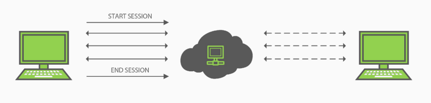
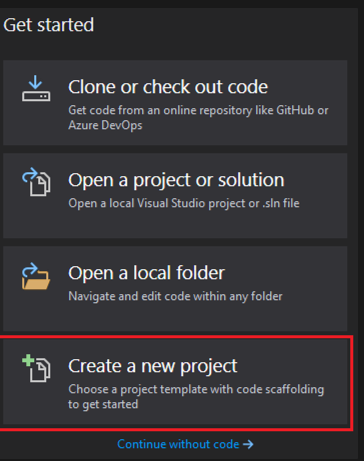

# Creacion de proyecto de prueba unitaria por comandos

- Abrir terminal en el directorio de la solucion. Para saber si estamos bien situados ejecutar `ls` y se deberia de ver el archivo `.sln`

```C#
ls
```

Comandos:

- `ls`: lista elementos en un directorio
<p align="center">

</p>

<p align="center">
[Terminal en directorio]
</p>

- Entrar al directorio del proyecto de prueba. Vidly.BusinessLogic.Test

```C#
cd Vidly.BusinessLogic.Test
```

Comandos y parametros:

- `cd`: entrar a un directorio

<p align="center">

</p>

<p align="center">
[Entrar a directorio de prueba]
</p>

- Agregar referencia a `Moq`

```C#
dotnet add package Moq
```

Comandos

- `add`: operacion de agregar
- `package`: paquete de `nuget.org`
- `Moq`: nombre de paquete

<p align="center">

</p>

<p align="center">
[Agregar Moq]
</p>

- Chequear que se agrego `Moq`. Hacer doble click en `Vidly.BusinessLogic.Test.csproj`
<p align="center">

</p>

<p align="center">
[Chequear Moq]
</p>
</p>

- Agregar referencia a `FluentAssertions`

```C#
dotnet add package FluentAssertinos
```

Comandos

- `add`: operacion de agregar
- `package`: paquete de `nuget.org`
- `FluentAssertions`: nombre de paquete

<p align="center">

</p>

<p align="center">
[Agregar FluentAssertions]
</p>

- Chequear que se agrego `FluentAssertions`. Hacer doble click en `Vidly.BusinessLogic.Test.csproj`
<p align="center">

</p>

<p align="center">
[Chequear FluentAssertions]
</p>
</p>

