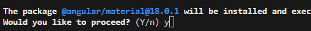
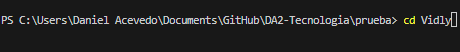
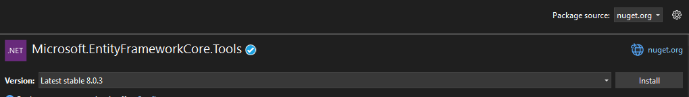
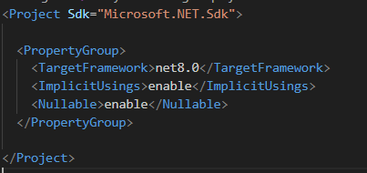
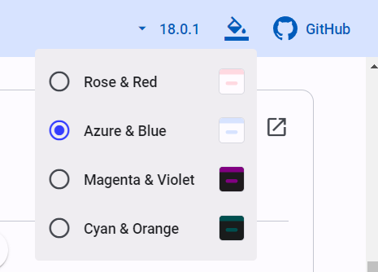
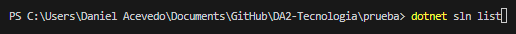
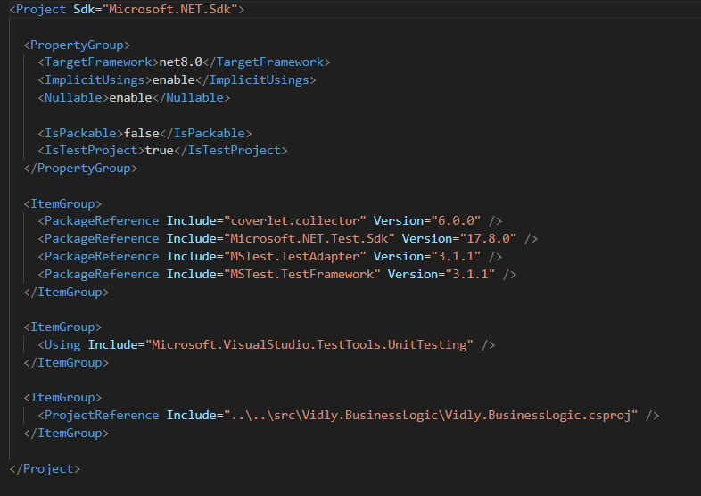

# Creacion de proyecto MSTest

A la solucion creada en el paso [Creacion de una Solucion](https://github.com/IngSoft-DA2/DA2-Tecnologia/blob/main/solution-creation.md) le vamos agregar un proyecto de prueba `MSTest` que pruebe un proyecto `ClassLib`.

- Abrir una terminal en el directorio de la solucion. Para saber si estamos bien situados ejecutar `ls` y se deberia de ver el archivo `.sln`

```
ls
```

Comandos:

- `ls`: lista elementos en un directorio

<p align="center">

</p>
<p align="center">
[Terminal en directorio]
</p>

- Para crear el proyecto `MSTest` nos situaremos en la carpeta `tests` con la terminal ejectuando:

```
cd tests
```

Comandos:

- `cd`: movimiento a un directorio en particular

- Una vez parados en la carpeta `tests` con la terminal, crearemos un proyecto `MSTest`

```C#
dotnet new mstest -n Vidly.BusinessLogic.Test
```

Comandos y parametros:

- `new`: crea un nuevo proyecto
- `mstest`: tipo de proyecto a crear
- `-n`: nombre del proyecto
- `Vidly.BusinessLogic.Test`: `Vidly` es el contexto del negocio, `BusinessLogic` es el proyecto que quiero probar, `Test` para indicar que son pruebas

<p align="center">

</p>

<p align="center">
[Creacion proyecto MSTest]
</p>

- Chequear que se creo el proyecto. En el directorio ejecutar `ls`.

```C#
ls
```

<p align="center">

</p>

<p align="center">
[Chequear creacion de proyecto]
</p>

- Ahora dicho proyecto `MSTest` lo debemos de agregar a la solucion. Para esto debemos situarnos con la terminal en el directorio donde esta la solucion `.sln`, para esto ejecutaremos:

```
cd ..
```

Comandos:

- `cd ..`: nos posiciona la terminal en un directorio para atras

Una vez que estemos bien situados, para agregar el proyecto a la solucion `.sln` debemos ejecutar:

```C#
dotnet sln add tests/Vidly.BusinessLogic.Test
```

Comandos y parametros

- `sln`: operar con solucion
- `add`: agregar proyecto a la solucion
- `test/Vidly.BusinessLogic.Test`: nombre del proyecto a agregar a la solucion

<p align="center">

</p>

<p align="center">
[Agregar proyecto a solucion]
</p>

- Chequear que se agrego el proyecto a la solucion

```C#
dotnet sln list
```

Comandos:

- `sln`: operar con solucion
- `list`: listar proyectos en solucion

<p align="center">

</p>

<p align="center">
[Chequear que se agrego a la solucion]
</p>

- Debemos agregar el proyecto `ClassLib` que se quiere probar a la solucion. Para esto debemos situarnos en la carpeta `src` ejecutando el siguiente comando:

```
cd src
```

- En este directorio crearemos nuestro proyecto `ClassLib` que agrupe nuestra logica de negocio, para ello ejecutaremos lo siguiente:

```
dotnet new classlib -n Vidly.BusinessLogic
```

<p align="center">

</p>

<p align="center">
[Creacion proyecto ClassLib]
</p>

- Para chequear que se creo el proyecto, ejecutaremos lo siguiente:

```
ls
```

<p align="center">

</p>

<p align="center">
[Verificacion]
</p>

Y el archivo `Vidly.BusinessLogic.csproj` debe verse de la siguiente manera:

<p align="center">

</p>

<p align="center">
[Archivo configuracion del proyecto BusinessLogic]
</p>

- Ahora se debe agregar referencia del proyecto `ClassLib` a la solucion ejecutando los siguientes comandos de forma individual:

```C#
cd ..
dotnet sln add src/Vidly.BusinessLogic
```

- Para verificar que fue agregado exitosamente se debe ejecutar el siguiente comando:

```C#
dotnet sln list
```

<p align="center">

</p>

<p align="center">
[Verificacion proyecto agregado a solucion]
</p>

- Una vez teniendo los proyectos en la solucion `.sln` debemos agregar la referencia del proyecto `ClassLib` al proyecto `MSTest`. Para ello debemos ejecutar el siguiente comando desde el proyecto `MSTest`:

```C#
cd tests
cd Vidly.BusinessLogic.Test
dotnet add reference ../../src/Vidly.BusinessLogic/Vidly.BusinessLogic.csproj
```

Comandos:

- `add`: operacion para agregar
- `reference`: referencia a proyecto en solucion
- `../../src/Vidly.BusinessLogic/Vidly.BusinessLogic.csproj`: archivo de configuracion del proyecto a probar

  <p align="center">
  
  </p>

  <p align="center">
  [Agregar referencia]
  </p>

- Para chequear que se agrego bien la referencia, hacer doble click en `Vidly.BusinessLogic.Test.csproj`
<p align="center">

</p>
<p align="center">
[Vidly.BusinessLogic.Test.csproj]
</p>
