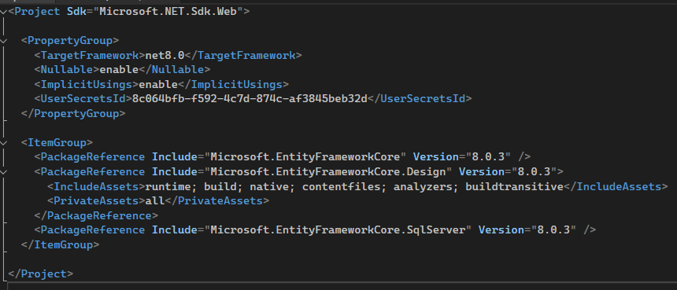
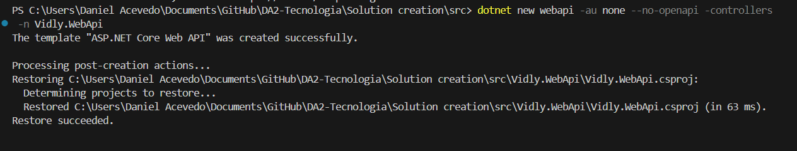
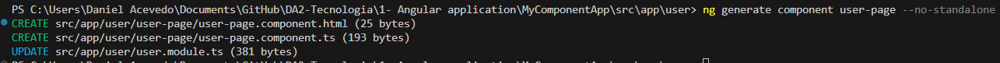

[Atras - Indice](https://github.com/daniel18acevedo/DA2-Tecnologia/tree/angular-component)

# Creacion de componentes pagina

## Definicion

Los componentes pagina son los componentes mas grandes que la aplicacion puede tener. Estos seran usados por la navegacion url por medio de la ruta raiz y su contenido esta constituido por muchos otros componentes mas pequeños y anidados.

Los componentes pagina son muy utiles para cambiar el diseño o la distribucion completa en la navegacion de una pagina a otra. Esto quiere decir que si diseñamos dos paginas completamente distintas, donde no hay ningun reuso de elementos estaticos entre ellos, se debera de crear dos componentes pagina que atiendan diferentes ruta raiz.

A medida que nos vamos adentrando en los niveles de la URL, la magnitud de los componentes pagina van minorizando, cada vez hay mas elementos estaticos y el espacio reservado para el dinamismo es cada vez menor.

Cuando hablamos de niveles de ruta, nos referimos a lo siguiente:

```
https://localhost:3000/movie/create
\____________________/\____/\_____/
          |              |      |
       dominio          raiz  segundo nivel
```

En este ejemplo tenemos dos niveles:

- Raiz: `movie`
- Segundo nivel: `create`

La ruta raiz siempre es el primer nivel. Dado este ejemplo tendriamos una pagina raiz que seria `MoviePageComponent` donde dentro de esta pagina se definirian elementos estaticos, y como tiene hijos definidos es necesario definir un espacio para el dinamismo.

Otro ejemplo seria:

```
https://localhost:3000
\____________________/\/
          |            |
        dominio      raiz vacia
```

Donde el unico nivel que existe es la raiz y es `/` (vacio). Esto implica que deberia de existir una pagina, llamemosle por el momento `HomePageComponent`, el cual define todos los componentes a visualizar en esta ruta raiz vacia.

Otro diseño posible es aquel donde queremos dejar una vista estatica siempre en la raiz pero tener a la vez el dinamismo, para eso tenemos la ruta:

```
https://localhost:3000/create-movie
```

Donde tendriamos la definicion de la ruta raiz `/` que sera atendido por el componente `HomePageComponent` donde este definira los elementos estaticos y el espacio reservado para el dinamismo para atender las rutas hijas como `create-movie`.

Como conclusion, a medida que nos vamos adentrando a los niveles de una ruta, vamos a encontrar mas elementos estaticos y componentes mas pequeños que son invocados cuando existe un matcheo con la ruta definida. Otro concepto importante es que los componentes con el sufijo `Page` son para aquellos elementos que son instanciados cuando ocurren un matcheo con la ruta raiz dando referencia a que la pagina visual completa es nueva.

## Creacion

Procederemos a crear los elementos pagina para las paginas de autenticacion, pelicula y usuario. En un paso anterior creamos los modulos `authentication`, `movie` y `user`, los elementos pagina estaran situados en sus respectivos modulos.

Como ahora estamos en presencia de modulos, es necesario que los componentes ya no sean `standalone`, para eso, utilizaremos la flag `no-standalone` para crear los componentes para que se vinculen con el modulo mas cercano encontrado.

Previavmente a la creacion del componente, tenemos que situarnos en la carpeta del modulo que debe declarar dicho componente.

```CMD
cd src
cd app
cd authentication
```

Una vez bien situados en el directorio, ejecutar el siguiente comando para la creacion de un componente pagina sin `standalone`.

```CMD
ng generate component authentication-page --no-standalone
```

Parametros:

- `no-standalone`: le indica a Angular que el componente no sea autogestionable y sea declarado en el modulo que encuentre mas cercano.

Una vez finalizada la creacion del componente pagina, tendremos lo siguiente:

<p align="center">

</p>
<p align="center">
[Mensaje de salida]
</p>

Podemos observar las acciones involucradas en la ejecucion del comando por Angular CLI. Este creo los elementos correspondientes al componente y actualizo el modulo mas cercano encontrado, el cual fue el modulo de autenticacion.

<p align="center">

</p>
<p align="center">
[Directorio, archivos nuevos y actualizacion de modulo]
</p>

Teniendo el modulo asi:

```TypeScript
@NgModule({
  declarations: [AuthenticationPageComponent],
  imports: [CommonModule, AuthenticationRoutingModule],
})
export class AuthenticationModule {}
```

Donde podemos observar como el modulo dentro de la property de declaraciones, declara el componente pagina recien creado, `AuthenticationPageComponent`

### Creacion pagina de usuario y pelicula

Repetir los pasos para la creacion de la pagina de usuario y pelicula, adecuando lo necesario.

Deberemos de tener como resultado lo siguiente:

#### User

<p align="center">

</p>
<p align="center">
[Mensaje de salida]
</p>

<p align="center">

</p>
<p align="center">
[Directorio, archivos nuevos y actualizacion de modulo]
</p>

#### Movie

<p align="center">

</p>
<p align="center">
[Mensaje de salida]
</p>

<p align="center">

</p>
<p align="center">
[Directorio, archivos nuevos y actualizacion de modulo]
</p>
