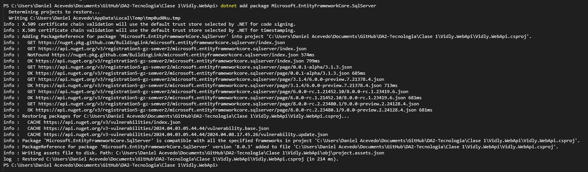
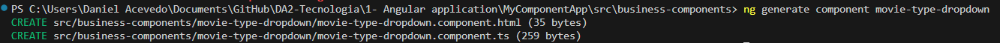
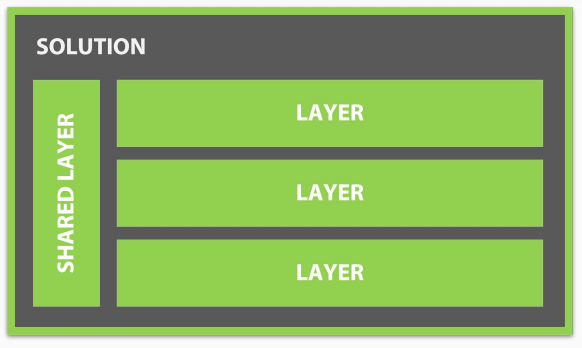

[Atras - Indice](https://github.com/daniel18acevedo/DA2-Tecnologia/tree/angular-component)

# Creacion de componente

En esta seccion realizaremos la implementacion de los componentes generico `button`, `input`, `dropdown` y un componente relacionado al negocio `movie-type-dropdown`. Estos estaran situados en `components` y `business-components` respectivamente, respetando la organizacion propuesta.

```
|
|── src
|   |── components
|   |   |── button
|   |   |── input
|   |   |── dropdown
|   |── busniess-components
|   |   |── movie-type-dropdown
```

Dichos componentes los vamos a crear como standalone ya que queremos que sean autogestionados para la facil importacion de los mismos. Esta es una de las ventajas que esta funcionalidad nueva de Angular propone, el poder importar elementos unicamente necesarios. Si se crea un modulo para declarar todos los componentes en la carpeta `components` y otro modulo para declarar los componentes en la carpeta `business-components`, quien quiera usar al menos un elemento de alguno de estos modulos, terminara importando todos los componentes exportados por estos. Esto presenta una desventaja a la hora de performance ya que si solo quiere usar un componente se termina importando el modulo entero.

Dado que creamos la aplicacion de Angular como `no-standalone` esta funcionalidad esta apagada para nuestra aplicacion, por lo que siempre que queramos crear un elemento nos va a requerir usar modulos. Para habilitar dicha funcionalidad nos dirijimos al archivo `angular.json` y modificamos la property `standalone` de `false` a `true` en la definicion del esquema de un componente. Tambien actualizaremos que se deban crear elementos separados para el template HTML. Teniendo como resultado lo siguiente:

<p align="center">

</p>
<p align="center">
[angular.json actualizado]
</p>

## Paso previo a la creacion de un componente en components

Antes de crear un componente en `components` es necesario situarnos en el lugar correcto para su creacion, para eso nos situamos en `src` y creamos la carpeta `components` normalmente o con la terminal:

```CMD
cd src
mkdir components
```

## Creacion del componente button

Para la creacion de un componente se debe ejecutar el comando:

```CMD
ng generate component <<nombre del componente>>
```

Esto generara una carpeta con el nombre de la carpeta que agrupa los elementos necesarios para un componente.

```CMD
ng generate component button
```

Obteniendo el siguiente componente:

<p align="center">

</p>
<p align="center">
[Mensaje de salida]
</p>
<p align="center">

</p>
<p align="center">
[Directorio y archivos nuevos]
</p>

La responsabilidad de este componente es encapsular el template HTML y logica que un componente boton deberia de tener siempre en nuestra aplicacion. De esta forma nos ahorramos definir constantemente el componente en los lugares que queremos utilizarlo.

Es importante destacar que para la generacion de cualquier elemento a traves de Angular CLI, no se pone el tipo del elemento ya que este es puesto por la herramienta.

Este componente definira los siguientes parametros para ser configurado y utilizado:

- `title`: un titulo a desplegar
- `onClick`: un comportamiento que se ejcutara cuando se haga click

Teniendo la logica del componente `button.component`:

```TypeScript
@Component({
  selector: 'app-button',
  standalone: true,
  imports: [],
  templateUrl: './button.component.html',
  styles: ``,
})
export class ButtonComponent {
  @Input({required: true }) title!: string;
  @Input({ requiered: true }) onClick!: () => void;
}
```

Y usado en `app.component` asi:

```HTML
<app-button title="Guardar" [onClick]="onClick" />
```

Donde se le pasa un valor estatico a la property `title`, estatico porque no se lee el valor de una variable del estado del componente `app.component`, y se le pasa la funcion `onClick` definida en `app.component` a la property `onClick` del component `button.component`.

## Creacion del componente input y dropdown

Repetir los pasos de la creacion del componente.

### Input

<p align="center">

</p>
<p align="center">
[Mensaje de salida]
</p>

<p align="center">

</p>
<p align="center">
[Directorio y archivos nuevos]
</p>

Este componente definira los siguientes parametros para ser configurado y utilizado:

- `label`: una lable en caso de querer mostrar uno
- `placeholder`: un placeholder en caso de querer mostrar uno
- `type`: tipo del input
- `value`: el valor del input

Teniendo la logica del componente `input.component`:

```TypeScript
@Component({
  selector: 'app-input',
  standalone: true,
  imports: [FormsModule],
  templateUrl: './input.component.html',
  styles: ``,
})
export class InputComponent {
  @Input() label: string | null = null;
  @Input() placeholder | null = null;
  @Input() type: 'text' | 'number' | 'password' = 'text';
  @Input() value: string | null = null;

  @Output() valueChange = new EventEmitter<string>();

  public onValueChange(event: any): void {
    this.valueChange.emit(event.target.value);
  }
}
```

Y usado en `app.component` asi:

```HTML
<app-input
  type="text"
  placeholder="example of input"
  label="example of label"
  [(value)]="input" />
```

### Dropdown

<p align="center">

</p>
<p align="center">
[Mensaje de salida]
</p>

<p align="center">

</p>
<p align="center">
[Directorio y archivos nuevos]
</p>

Este componente definira los siguientes parametros para ser configurado y utilizado:

- `options`: un array de elementos de una estructura determinada a desplegar
- `label`: una lable en caso de querer mostrar uno
- `placeholder`: un placeholder en caso de querer mostrar uno
- `emptyMessage`: un mensaje para indicar que no hay elementos
- `value`: el valor del elemento seleccionado

Teniendo la logica del componente `dropdown-component`:

```TypeScript
export class DropdownComponent implements OnInit {
  @Input({ required: true }) options!: Array<DropdownOption>;
  @Input() label: string | null = null;
  @Input() placeholder: string | null = null;
  @Input() emptyMessage = 'No options found';
  @Input() value: string | null = null;

  @Output() valueChange = new EventEmitter<string>();

  public ngOnInit(): void {
    if (!this.options || this.options.length === 0) {
      return;
    }

    if (!this.value && !this.placeholder) {
      this.onChange({ target: { value: this.options[0].value } });
    }
  }

  public onChange(event: any) {
    const newOption =
      event.target.value === 'null' ? null : event.target.value;
    this.valueChange.emit(newOption);
  }
}
```

Y es usado en `app.component` asi:

```HTML
<app-dropdown
  [options]="elements"
  [(value)]="optionSelected"
  placeholder="Seleccione un item" />
```

## Creacion del componente movie-type-dropdown

Antes de crear un componente en `business-components` es necesario situarnos en el lugar correcto para su creacion, para eso nos situamos en `src` y creamos la carpeta `business-components` normalmente o con la terminal:

```CMD
cd src
mkdir business-components
```

Luego ejecutamos el comando para crear el componente:

```CMD
ng generate component movie-type-dropdown
```

Obteniendo el siguiente componente:

<p align="center">

</p>
<p align="center">
[Mensaje de salida]
</p>

<p align="center">

</p>
<p align="center">
[Directorio y archivos nuevos]
</p>

Este componente definira los siguientes parametros para ser configurado y utilizado:

- `value`: el valor del elemento seleccionado

La responsabilidad de este componente es encapsular el template HTML y logica que el componente `movie-type-dropdown` deberia de tener siempre en nuestra aplicacion. De esta forma nos ahorramos definir constantemente el componente en los lugares que queremos utilizarlo. La logica de este componente sera usar el componente `dropdown` encapsulando las configuraciones necesarias para que siempre despliegue los tipos de peliculas.

Siendo la logica del componente `movie-type-dropdown` asi:

```TypeScript
@Component({
  selector: 'app-movie-type-dropdown',
  standalone: true,
  imports: [DropdownComponent],
  templateUrl: './movie-type-dropdown.component.html',
  styles: ``,
})
export class MovieTypeDropdownComponent {
  movieTypes: Array<DropdownOption> = [
    { label: 'Action', value: 'action' },
    { label: 'Comedy', value: 'comedy' },
    { label: 'Drama', value: 'drama' },
    { label: 'Horror', value: 'horror' },
    { label: 'Sci-Fi', value: 'sci-fi' },
  ];
  @Input() value: string | null = null;
}
```

## Uso de los componentes

Estos componentes momentaneamente los vamos a utilizar en `app.component`. Para utilizar los componentes es necesario importarlos en el modulo del componente donde queremos utilizarlos. Teniendo como resultado el `app.module` de la siguiente manera:

```TypeScript
@NgModule({
  declarations: [AppComponent],
  imports: [
    BrowserModule,
    ButtonComponent,
    InputComponent,
    DropdownComponent,
    AppRoutingModule,
  ],
  providers: [],
  bootstrap: [AppComponent],
})
export class AppModule {}

```
