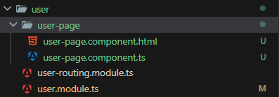
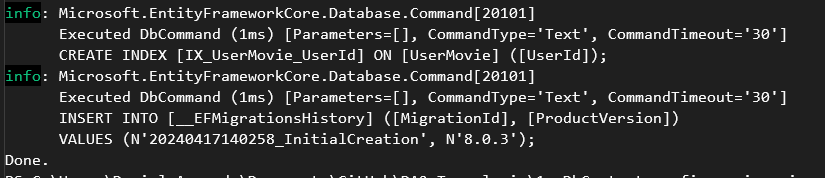
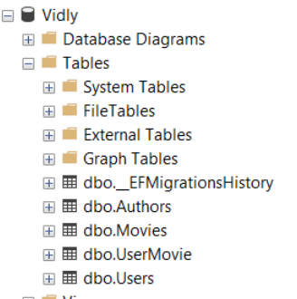

# Primeros pasos

Para iniciar con EF Core en nuestra aplicacion, es necesario instalar el paquete `Microsoft.EntityFrameworkCore`.

- [Visual Studio](https://github.com/daniel18acevedo/DA2-Tecnologia/blob/ef-core/install-ef-core-visual-studio.md)

- [Por comandos](https://github.com/daniel18acevedo/DA2-Tecnologia/blob/ef-core/install-ef-core-dotnet-cli.md)

## Crear contexto concreto

Una vez instalado EF Core en el proyecto con la responsabilidad de interactuar con la base de datos. Debemos de crear una clase concreta, especifica para nuestro negocio que configure la conexion a la base de datos. Esta clase se identifica por ser un `contexto concreto`.

```C#
public sealed class VidlyDbContext : DbContext
{
  // some code
}
```

El nombre del `contexto concreto` debe de dar informacion sobre de que negocio es el contexto, asi se puede identificar rapidamente con que base de datos opera y que tablas podemos encontrar en ella.

Tambien se podria dar informacion sobre que ORM utiliza, quedando el nombre asi:

```C#
public sealed class VidlyEfCoreContext : DbContext
{
  // some code
}
```

Esta notacion es util cuando se tienen varios `contextos concretos` y se utilizan ORM diferentes, algunos relacionales y otros no relacionales.

## Crear tablas

Dentro del `contexto concreto` deberemos de configurar el set de tablas con las que el contexto puede trabajar.

```C#
public sealed class VidlyDbContext : DbContext
{
  public DbSet<Movie> Movies { get; set; }

  public DbSet<User> Users { get; set; }
}
```

Las properties de tipo `DbSet` son las que indicaran que tablas se tendran que crear en la base de datos y el nombre es tomado por el nombre de la property. Esto implica que con el ejemplo se van a crear dos tablas, una `Users` y otra `Movies`.

## Conexion a la base de datos

A la hora de indicar que nuestro contexto se deba de conectar a a la base de datos, debemos de ser lo mas flexible posibles ya que, nuestra base puede variar segun el ambiente en el cual queramos correr la aplicacion. Esto quiere decir, que podemos tener diferentes base de datos, una por cada ambiente en la cual ejecutemos nuestra aplicacion.

Podemos tener los siguientes ambientes:

- Produccion: la base de datos guardara informacion real de nuestra aplicacion de usuarios finales.

- Desarrollo: la base de datos guardara informacion muy parecida a la real en produccion, sirve para trabajar con un buen set de datos.

- QA: la base de datos aca es para probar libremente, sin miedo a dejar inconsistencias o probar cosas.

- Local: la base de datos es personal para cada desarrollador, sus datos no son compartidos.

Como nuestra aplicacion puede ser ejecutada en alguno de estos ambientes u otros, la forma de setear a que base de datos se debe de conectar el contexto, debe ser lo mas flexible posible. No solamente estamos siendo flexibles a que base de datos se esta conectando sino que tambien a que motor de base de datos se esta conectando. Para eso definiremos el siguiente constructor:

```C#
public sealed class VidlyDbContext : DbContext
{
  public DbSet<Movie> Movies { get; set; }

  public DbSet<User> Users { get; set; }

  public VidlyDbContext(DbContextOptions options)
    : base(options)
    {
    }
}
```

En caso de que nuestra aplicacion maneje mas de un contexto concreto, se debera de especificar de la siguiente manera:

```C#
public sealed class VidlyDbContext : DbContext
{
  public DbSet<Movie> Movies { get; set; }

  public DbSet<User> Users { get; set; }

  public VidlyDbContext(DbContextOptions<VidlyDbContext> options)
    : base(options)
    {
    }
}
```

Con el contexto hasta ahora es suficiente para crear las migraciones y utilizarlo para ejecutar consultas a nuestra base de datos. Toda la interaccion contra la base debe ser a traves de un contexto concreto, ya que es la clase que configura la conexion.

## Configuracion del motor de base de datos

Previamente a utilizar el contexto concreto en nuestra aplicacion, debemos de configurarlo para que utilice la base de datos del ambiente que se este ejecutando.

La configuracion tomara lugar en el inicio de nuestra aplicacion, bajo el contexto de una web api en .NET 8 es en la clase `Program.cs`.

Como se dijo anteriormente, EF Core es un framework que soporta multiples proveedores de base de datos, alguno de ellos son: SQL Server, SQLite, MySQL, PostgreSQL. Para hacer uso cualquiera de ellos, es necesario instalar el paquete correspondiente en nuestra solucion.

Los paquetes para esos proveedores son los siguients:

- [Microsoft.EntityFrameworkCore.SqlServer](https://www.nuget.org/packages/Microsoft.EntityFrameworkCore.SqlServer)
- [Microsoft.EntityFrameworkCore.Sqlite](https://www.nuget.org/packages/Microsoft.EntityFrameworkCore.Sqlite)
- [Microsoft.EntityFrameworkCore.MySql](https://www.nuget.org/packages/Pomelo.EntityFrameworkCore.MySql)
- [Microsoft.EntityFrameworkCore.PostgreSQL](https://www.nuget.org/packages/Pomelo.EntityFrameworkCore.MySql)

Pueden encontrar mas sobre los diferentes proveedores de base de datos que soporta EF Core [aca](https://learn.microsoft.com/en-us/ef/core/providers/?tabs=dotnet-core-cli)

A continuacion se detallara como instalar el proveedor `Microsoft.EntityFrameworkCore.SqlServer`, para operar con dicho motor de base de datos con EF Core.

- [Visual Studio](https://github.com/daniel18acevedo/DA2-Tecnologia/blob/ef-core/install-sql-server-visual-studio.md)
- [Por comandos](https://github.com/daniel18acevedo/DA2-Tecnologia/blob/ef-core/install-sql-server-dotnet-cli.md)

```C#
var builder = WebApplication.CreateBuilder(args);

// Add services to the container.

builder.Services.AddControllers();

var services = builder.Services;
var configuration = builder.Configuration;

var vidlyConnectionString = configureation.GetConnectionString("Vidly");
if(string.IsNullOrEmpty(vidlyConnectionString))
{
  throw new Exception("Missing Vidly connection string");
}

services.AddDbContext<DbContext, VidlyDbContext>(options => options.UseSqlServer(connectionString));

var app = builder.Build();
// Configure the HTTP request pipeline.

app.UseHttpsRedirection();

app.UseAuthorization();

app.MapControllers();

app.Run();
```

<p align="center">
[Configuracion de ef core para usar sql server]
</p>

En esta configuracion leemos el `connection-string` segun el ambiente en el cual se ejecute la web api. En caso de que no se encuentre un valor configurado, se lanza una excepcion causando la interrupcion de la web api. Para evitar conflictos los archivos de configuracion deben encontrarse de la siguiente manera:

```JSON
{
  "ConnectionStrings":{
    "Vidly": ""
  }
}
```

<p align="center">
[appsettings.json, no debe estar ignorado por GitHub]
</p>

```JSON
{
  "ConnectionStrings":{
    "Vidly": "test"
  }
}
```

<p align="center">
[appsettings.Development.json, debe de ser ignorado por GitHub]
</p>

Posteriormente se configura la inyeccion de `VidlyDbContext` con el uso de SQL Server y usando el `connection-string` provisto.

## Primera migracion

Para realizar migracines es necesario instalar el paquete:

- **Microsoft.EntityFrameworkCore.Design**: sirve para que EF Core logre interpretar las entidades y pueda realizar un modelado de tablas

<!-- - **Microsoft.EntityFrameworkCore.Tools**: permite crear y aplicar migraciones y generar codigo a partir de una base de datos existente. -->

Instalacion en:

- [Visual Studio](https://github.com/daniel18acevedo/DA2-Tecnologia/blob/ef-core/install-migrations-visual-studio.md)

- [Por comandos](https://github.com/daniel18acevedo/DA2-Tecnologia/blob/ef-core/install-migrations-dotnet-cli.md)

La creacion de las migraciones y ejecucion de las mismas, ocurren por consola:

### 1. Chequear que estoy en la raiz de la solucion

```
ls
```

Comandos:

- `ls`: lista eleemntos en un directorio

### 2. Instalar tools

```
dotnet tool install --global dotnet-ef
```

### 3. Pararse en el proyecto donde se encuentra el contexto

```
cd Vidly.WebApi
```

Comandos:

- `cd`: entrar a un directorio
- `Vidly.WebApi`: directorio al cual quiero acceder

### 4. Chequeo que estoy dentro de `Vidly.WebApi`

```
ls
```

### 5. Crear primera migracion

Para las migraciones no es necesario tener un valor valido para el `connection-string`, pero si es necesario que tenga un valor.

```
dotnet ef migrations add InitialCreation --verbose
```

Comandos:

- `dotnet`: programa para ejecutar comandos de dotnet

- `ef`: parametro para operar con base de datos

- `migrations`: parametro para operar con migraciones

- `add`: parametro para indicar la creacion de una migracion

- `InitialCreation`: nombre de la migracion

- `verbose`: para que se imprima a detalle lo que se esta ejecutando y los errores

#### 5.1 Contexto en otro proyecto

En caso de que el contexto se encuentre en otro proyecto distinto al proyecto donde se configura el contexto, en este caso en `Vidly.WebApi`, el comando a ejecutar es el siguiente:

```
dotnet ef migrations add InitialCreation --verbose --startup-project ../<<directorio del proyecto de web api>>
```

Comando extra:

- `--startup-project`: indicacion del proyecto donde se encuentra la configuracion del contexto para usar en tiempo de diseño.

### 6. Chequear que se creo la migracion

<p align="center">

</p>

<p align="center">
[Resultado de creacion exitoso]
</p>

<p align="center">

</p>

<p align="center">
[Carpeta de migraciones con las clases]
</p>

Se debio de crear una carpeta `Migrations` en el directorio donde se ejecuto el comando de migracion.

Pueden encontrar mas informacion sobre las clases que se crearon [aca](https://github.com/daniel18acevedo/DA2-Tecnologia/blob/ef-core/migration-result.md).

### 7. Ejecutar migracion

Para este paso es necesario que el `connection-string` dentro del archivo de configuracion del ambiente `appsettings.Development.json` tenga un valor valido para entablar una conexion con SQL Server.

Para windows:

```JSON
{
  "ConnectionStrings":{
    "Vidly": "Server=localhost;Database=Vidly; Integrated Security=True;Trusted_Connection=True;MultipleActiveResultSets=True;TrustServerCertificate=True"
  }
}
```

Pueden descargar SQL Server en Windows [aca](https://www.microsoft.com/en-us/sql-server/sql-server-downloads)

Para MacOS:

```JSON
{
  "ConnectionStrings":{
    "Vidly": "Server=localhost, <<su puerto>>; Database=Vidly; User ID=<<su usuario>>; Password=<<su password>>; Integrated Security=True; Trusted_Connection=True;"
  }
}
```
<p align="center">
  [Opcion 1]
</p>
  
```JSON
{
  "ConnectionStrings":{
    "Vidly": "Server=localhost, <<su puerto>>; Database=Vidly; User ID=<<su usuario>>; Password=<<su password>>; TrustServerCertificate=true;"
  }
}
```
<p align="center">
  [Opcion 2]
</p>

Pueden seguir la siguiente [guia](https://github.com/daniel18acevedo/DA2-Tecnologia/blob/ef-core/sql-with-docker.md) para tener SQL Server con Docker. Esta forma de trabajar con SQL Server es un requerimiento para MacOS y opcional para Windows.

Sustituir:

- `<<su usuario>>`: por el usuario que crearon ustedes en SQL Server

- `<<su password>>`: por la contraseña de ese usuairo en SQL Server

- `<<su puerto>>`: por el puerto indicado en la creacion del container

Ejecucion:

```
dotnet ef database update --verbose
```

Comandos:

- `database`: parametro para operar con la base

- `update`: parametro par actualizar la base

- `verbose`: para que se imprima a detalle lo que se esta ejecutando y los errores

En caso de que las migraciones se encuentren en otro proyecto distinto al proyecto donde se configura el contexto, en este caso en `Vidly.WebApi`, el comadno a ejecutar es el siguiente:

```
dotnet ef database update --verbose --startup-project ../<<directorio del proyecto de web api>>
```

<p align="center">

</p>

<p align="center">
[Resultado en consola de ejecutar la migracion]
</p>

### 8. Chequear la creacion de la base de datos

Utilizar el cliente a eleccion ([SQL Server Management Studio (SSMS)](https://learn.microsoft.com/en-us/sql/ssms/download-sql-server-management-studio-ssms?view=sql-server-ver16) o [Azure Data Studio](https://learn.microsoft.com/en-us/azure-data-studio/download-azure-data-studio?tabs=win-install%2Cwin-user-install%2Credhat-install%2Cwindows-uninstall%2Credhat-uninstall)) que interactua con SQL Server, y refrezcar para ver la nueva base de datos.

<p align="center">

</p>

<p align="center">
[Base de datos en Management Studio]
</p>

## Material de lectura

[Iniciar migraciones](https://learn.microsoft.com/en-us/ef/core/managing-schemas/migrations/?tabs=dotnet-core-cli)

[Gestionar migraciones](https://learn.microsoft.com/en-us/ef/core/managing-schemas/migrations/managing?tabs=dotnet-core-cli)

[Como indicar la configuracion del contexto para la migracion](https://learn.microsoft.com/en-us/ef/core/cli/dbcontext-creation?tabs=dotnet-core-cli)

[Entity Framework Core tools](https://learn.microsoft.com/en-us/ef/core/cli/dotnet)
