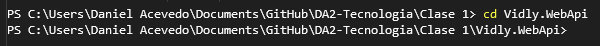

# Kestrel

Como ya se dijo, ASP.NET Core es un framework que es multi plataforma. Soporta tanto desarrollo como ejecucion en diferentes sistemas operativos como Windows, Linux o MacOS.

**Kestrel** es un web server multiplataforma y liviano para aplicaciones web ASP.NET Core. Este server soporta todas las plataformas que ASP.NET Core soporta.

**Kestrel** esta diseñado para ser rapido, escalable y eficiente que pueda manejar requests http y brindar contenido a clientes. **Kestrel** es el web server por defecto que viene con ASP.NET Core, y puede ser usado por si solo o en combinacion con algun otro web server como Apache, IIS, o Nginx.

Para verificar si se esta usando **Kestrel**, procedamos a abrir el navegador y la consola de desarrollo. Luego en la seccion de la URL poner la URL en la cual se estara escuchando las requests HTTP y se podra observar lo siguiente:

  

## Puntos claves y caracteristicas

- **Multiplataforma**: Es completamente multiplataforma y puede ser ejecutado en Windows, Linux y macOS. Esta diseñado para operar indiferentemente en cualquier sistema operativo.

- **Performance**: Esta optimizado para ser muy performante y es capaz de manejar grandes numeros de conexiones en simultaneo de forma eficiente. Es particularmente bien adecuado para servir archivos estaticos y manejar trabajos livianos.

- **Asynchronous I/O**: Fue desarrollado usando patrones de programacion asincrona, permitiendo manejar muchas requests con pocos threads, permitiendo una mejora del uso de recursos y responsabilidades.

- **Self-hosting**: Puede ser un web server independiente sin la necesidad de algun software adicional. Esto hace que la actividad de deploy y ejecucion de aplicaciones web ASP.NET Core en diferentes plataformas sea sencilla.

- **Integracion con reverse proxies**: Es comunmente usado con servidores reverse proxy como Ngingx o Apache. Los servidores reverse proxy manejan tareas como la terminacion SSL, balanceo de carga, y seguridad, mientras que **Kestrel** se enfoca en la logica de la aplicacion.

- **Soporta HTTPS**: Permite asegurar la aplicacion web con encriptacion SSL/TLS facilmente.

Cuando una aplicacion web ASP.NET Core es deployada, **Kestrel** es el primer punto de contacto para requests HTTP. Sin embargo, es importante destacar que aun asi siendo un servidor web muy poderoso, no cuenta con algunas funcionalidades y optimizaciones que uno puede encontrar en servidores web mas potentes como IIS. Aun asi, el uso de **Kestrel** en conjunto con un reverse proxy para un ambiente en produccion es muy comun.

## Ventajas

- **Modular y liviano**: Esta diseñado para ser minimalista y modular. Uno solo incluye y paga por los componentes necesarios, reduciendo el overhead y potenciales ataques.

- **Integracion con ASP.NET Core**: Esta fuertemente integrado con la infraestructura de ASP.NET Core, pudiendo tener una interaccion y configuracion muy fluida usando metodos de ASP.NET Core.

## Desventajas

- **Limitaciones**: Es un servidor web que no se recomienda ser expuesto directamente a internet, sin un reverse proxy en frente. Aunque **Kestrel** esta en constante evolucion, no cuenta aun con algunas funcionalidades (filtro de requests) o defensa ante ataques profundos en comparacion con otros servidores web que si cuentan con esto.

- **Mas inmaduro**: Por mas que viene recorriendo un largo trayecto y esta listo para ser usado en ambientes de produccion, es un servidor web mas nuevo que otros. Esto causa que le falten funcionalidades o pruebas en escenarios reales.

- **Complejidad en produccion**: En caso de contar con las necesidades de un reverse proxy, hacer uso de este servidor web, puede introducir un extra de complejidad de configuracion y puntos de fallo. Esto es asi cuando uno no esta familizarizado en la configuracion de reverse proxy.

- **Manejo de memoria**: El gran rendimiento de performance es en parte gracias a la descarga de grandes objetos para reducir la garbage collection. Sin embargo, esto puede aumentar el consumo de memoria en escenarios especificos si no es manejado de forma correcta.

## Conclusion

En resumen, **Kestrel** es un buena opcion como servidor web para aplicaciones ASP.NET Core por ser liviano, con alta performance y multiplataforma. Aun asi con sus limitaciones, especificamente como ser un servidor web expuesto directamente, ofrece algunas ventajas significativas, particularmente en velocidad y capacidades multiplataforma. Emparejar **Kestrel** con un reverse proxy puede balancear la performance y seguridad en muchos escenarios de tipo produccion.
