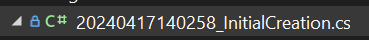
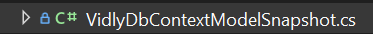

# Resultado de realizar una migracion

Al momento de crear la primera migracion se crean tres clases, la clase de la migracion, un designer y un snapshot. Para migraciones futuras solo se crearan dos clases, la clase de la migracion y el designer. A continuacion se mencionaran que rol juegan dichas clases.

<p align="center">

</p>

<p align="center">
[Carpeta de migraciones con las clases]
</p>

## 1. Clase de migracion: 20240417140258_InitialCreation.cs

<p align="center">

</p>

<p align="center">
[Clase de migracion]
</p>

La clase de migracion lleva el nombre de la migracion que se indico al momento de la creacion. Por ejemplo, si se ejecuta la migracion:

```
dotnet ef migrations add InitialCreation
```

Se va a crear una clase llamada `123123123_InitialCreation` la cual lleva un timestamp, indicando cuando fue creado, seguido del nombre indicado en el comando.

Esta clase representa las acciones a realizar en la migracion. Contiene instrucciones para migrar el esquema de la base dedatos de un estado a otro.

Dentro de esta clase podemos encontrar dos metodos, `Up` y `Down`.

El metodo `Up` contiene el codigo a aplicar en la migracion, codigo para indicar la creacion o modificacion de tablas, indexes o constraints, etc.

El metodo `Down` contiene el codigo para revertir la migracion, efectivamente deshaciendo cambios hechos en el metodo `Up`.

## 2. Clase de diseño:

<p align="center">

</p>

<p align="center">
[Clase de diseño]
</p>

Es la metadata de la migracion, contiene informacion sobre la migracion utilizada por EF Core. Es una extension del contexto ya que contiene configuracion de las entidades para que puedan ser interpretadas en nuestro sistema de forma correcta.

## 3. Clase de snapshot

<p align="center">

</p>

<p align="center">
[Clase de snapshot]
</p>

Las clase de snapshot, es una captura sobre el modelo actual, es usado para determinar que fue lo que se cambio al agregar una nueva migracion. Nos permite trackear los cambios y actualizar de forma correcta el esquema de base de datos.

## Conclusion

Estas clases son autogeneradas y escensiales para manejar las migraciones en EF Core. Nos permiten aplicar y revertir cambios al esquema de base de datos de forma efectiva y manetener un trackeo de la evolucion en el tiempo del esquema.

Es sumamente importante que estas clases no sean modificadas por fuera de las operaciones por la consola si se quieren evitar posibles problemas.

