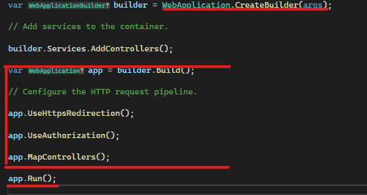
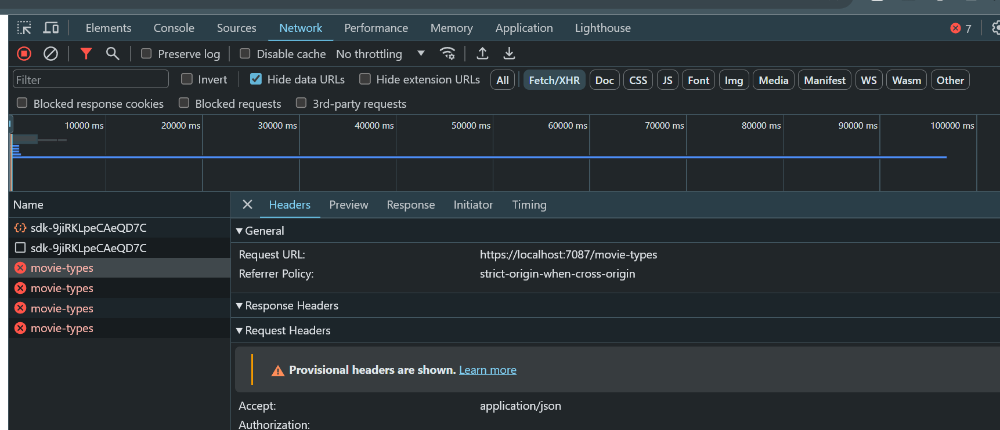

[Atras - Indice](https://github.com/daniel18acevedo/DA2-Tecnologia/tree/angular-service)

# Lectura de variable de ambiente

Las variables de ambiente deben ser dinamicas ya que sus valores dependen del ambiente en el cual la aplicacion deberia de correr. Por ejemplo cuando la aplicacion corre localmente espera que la api sea local tambien, cuando corremos la aplicacion en un ambiente `dev` esperamos que la api este corriendo en ese ambiente, y asi con los diferentes ambientes que pueden existir.

Nosotros vamos a utilizar dos ambientes: `local` y `prod`.

Primero debemos crear los archivos asociados a los ambientes que queremos utilizar. Estos archivos deben ubicarse en la carpeta `environments` situada en `src`.

Los archivos a crear se llamaran, `environment.prod.ts` y `environment.local.ts`. Estos archvios guardaran valores distintos para su ambiente de las variables definidas en `index.ts`.

Teniendo en `environment.prod.ts` lo siguiente:

```TypeScript
export default {
  vidlyApi: 'http://localhost:9000'
}
```

Donde este archivo apunta al host y puerto de nuestra api deployada en produccion.

Y en `environment.local.ts` lo siguiente:

```TypeScript
export default {
  vidlyApi: 'https://localhost:7106'
}
```

Donde este archivo apunta al host y puerto que tenemos en `launchSettings.json` de nuestra api.

Los valores definidos en cada archivo remplazaran los valores definidos en `index.ts` cuando indiquemos en que ambiente queremos ejecutar o compilar nuestra aplicacion. Estos archivos especificos de ambientes, deben ser ignorados en `.gitignore` ya que pueden contener valores sensibles.

Para ello debemos agregar en `.gitignore`:

```
environment.local.ts
environment.prod.ts
```

Para utilizar diferentes los archivos de ambiente, debemos modificar la seccion `scripts` del archivo `package.json` para que utilice diferentes ambientes cuando ejecute y compile la aplicacion. Dejando esta seccion de la siguiente manera:

```JSON
"scripts": {
    "ng": "ng",
    "start:local": "ng serve --configuration local",
    "start:prod": "ng serve --configuration prod",
    "build:prod": "ng build -- configuration prod",
    "watch": "ng build --watch --configuration development"
  },
```

Donde:

- `start:local`: es el comando a utilizar para correr la aplicacion usando el ambiente `environment.local`
- `start:prod`: es el comando a utilizar para correr la aplicacion usando el ambiente `environment.prod`
- `build:prod`: es el comando a utilizar para compilar la aplicacion usando el ambiente `environment.prod`

El siguiente paso es configurar la aplicacion de Angular que cuando se ejecuten esos scripts sustituya los valores de las variables encontradas en `index.ts` por los valores de las mismas variables en el archivo de ambiente. Es importante destacar que los archivos de ambiente deben definir las mismas variables que quieren sustituir.

Para ello debemos modificar el archivo `angular.json`, modificaremos dos secciones, `build` y `serve`. Dicho archivo nos debe de quedar de la siguiente manera:

```JSON
{
  // ...
  "projects": {
    "MyModuleApp": {
      // ...
      "prefix": "app",
      "architect":{
        "build": {
          // ...
          "configurations": {
            "prod": {
              "budgets": [
                {
                  "type": "initial",
                  "maximumWarning": "500kB",
                  "maximumError": "1MB"
                },
                {
                  "type": "anyComponentStyle",
                  "maximumWarning": "2kB",
                  "maximumError": "4kB"
                }
              ],
              "outputHashing": "all",
              "fileReplacements": [
                {
                  "replace": "src/environments/index.ts",
                  "with": "src/environments/environment.prod.ts"
                }
              ]
            },
            "local": {
              "optimization": false,
              "extractLicenses": false,
              "sourceMap": true,
              "fileReplacements": [
                {
                  "replace": "src/environments/index.ts",
                  "with": "src/environments/environment.local.ts"
                }
              ]
            }
          },
          "defaultConfiguration": "prod"
        },
        "serve": {
          // ...
          "configurations": {
            "prod": {
              "buildTarget": "MyModuleApp:build:prod"
            },
            "local": {
              "buildTarget": "MyModuleApp:build:local"
            }
          },
          "defaultConfiguration": "local"
        },
      }
    }
  }
}
```

Una vez creado los archivos de ambiente, los scripts a utilizar y la configuracion de la aplicacion para usar dichos ambientes, la forma de ejectuar cada script es la siguiente:

Para ejecutar `start:local`, se debe correr:

```
npm run start:local
```

Para ejecutar `start:prod`, se debe correr:

```
npm run start:prod
```

Para ejecutar `build:prod`, se debe correr:

```
npm run build:prod
```

Si ejecutamos la aplicacion dos veces, una por cada ambiente, veremos que el valor de `vidlyApi` cambia en funcion al ambiente:

<p align="center">

</p>
<p algin="center">
[Evidencia de uso de environment.prod.ts]
</p>

<p align="center">

</p>
<p algin="center">
[Evidencia de uso de environment.local.ts]
</p>

Para visualizar dicha evidencia es necesario abrir la consola de desarrollo del navegador, haciendo click derecho en la pagina e inspect o con F12. Una vez abierta la consola de desarrollo, dirjirse a la seccion `Network`, filtrar por `Fetch/XHR`, refrezcar la pagina y hacer click en el nombre `movie-types`.

<p align="center">

</p>
<p algin="center">
[Consola de desarrollo en Network]
</p>
