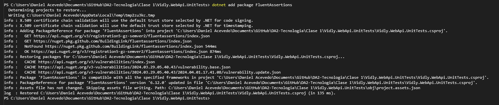
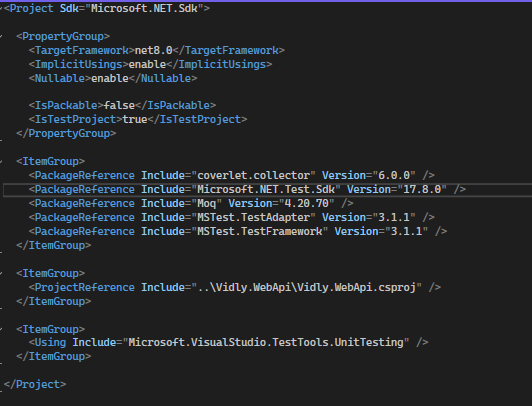
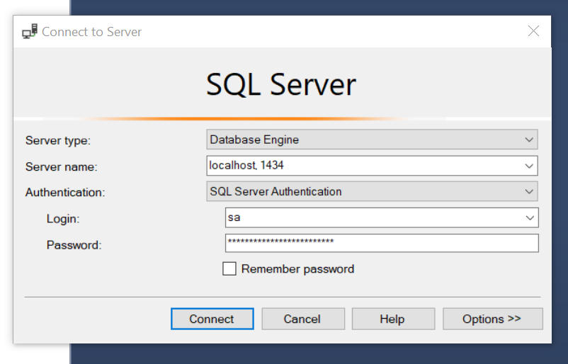
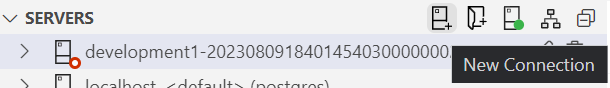
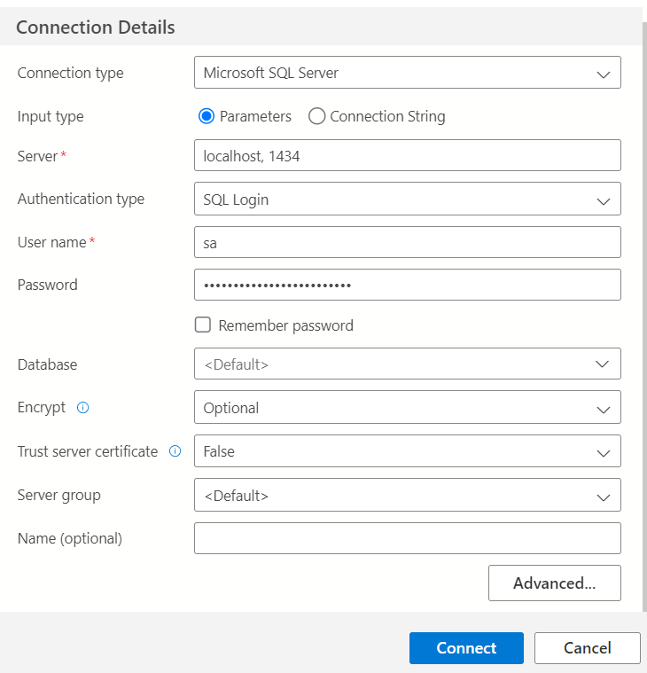
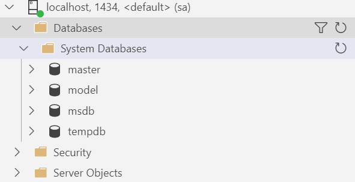

# SQL con Docker

## 1. Instalar Docker

Si no se tiene instalado Docker se puede descargar de [aca](https://www.docker.com/products/docker-desktop/). Una vez que se tenga instalado docker nos aseguramos de que este en ejecucion

<p align="center">

</p>

<p align="center">
[Ejecicion de docker]
</p>

## 2. Limpieza de recursos no utilizados

Ejecutar los siguientes comandos en orden para hacer una limpieza de los networks como en system.

```
docker network prune
```

```
docker rm -f `docker ps -q -a`
```

<p align="center">
[Si ocurre un error con este comando es normal, significa que no haya ningun container en ejecucion o detenido]
</p>

```
docker system prune
```

## 3. Crear una red de desarrollo para DA2

Este paso es opcional, puede ser util diferenciar los ambientes entre las redes.

```
docker network create dev-da2-network
```

## 4. Instalacion de SQL Server

Para instalar SQL Server con Docker, es necesario descargar la ultima imagen de SQL Server desde Azure.

```
docker pull mcr.microsoft.com/azure-sql-edge
```

<p align="center">

</p>

<p align="center">
[Imagen de SQL Server descargada]
</p>

## 5. Crear un container

Lo siguiente es crear un contenedor llamado: `DEV-SQL` que usara la imagen descargada.

Si se creo una red, ejecutar el comando:

```
docker run --network dev-da2-network -e "ACCEPT_EULA=1" -e "MSSQL_SA_PASSWORD=MySuperStrongPassword1(!)" -e "MSSQL_PID=Developer" -e "MSSQL_USER=sa" -p 1433:1433 -d --name=DEV-SQL mcr.microsoft.com/azure-sql-edge
```

Si no se creo una red, ejecutar el comando:

```
docker run -e "ACCEPT_EULA=1" -e "MSSQL_SA_PASSWORD=MySuperStrongPassword1(!)" -e "MSSQL_PID=Developer" -e "MSSQL_USER=sa" -p 1433:1433 -d --name=DEV-SQL mcr.microsoft.com/azure-sql-edge
```

Sustituir:

- `MySuperStrongPassword1(!)`: por otra contraseña a eleccion o usar esa
- `sa`: por otro usuario a eleccion o usar ese.

```
En caso de tener un servicio en ejecucion en el puerto 1433, se debera de sustituir -p 1433:1433 por -p <<puerto disponible a eleccion>>:1433
```

Una vez ejecutado el comando, se debera de observar el contenedor activo:

<p align="center">

</p>

<p align="center">
[Contenedor DEV-SQL en ejecucion]
</p>

## 6. Conectarse al contenedor

Con el cliente a eleccion para conectarse a SQL Server, se debera de proveer la informacion del server, usuario y contraseña para entablar una conexion exitosa.

**Con Management Server:**

<p align="center">

</p>

<p align="center">
[Crear nueva conexion]
</p>

```
Sustituir los valores de Server name, Login y Password, por los provistos en el paso: 5. Crear un container
```

**Con Azure Data Studio:**

### 1. Nueva conexion

<p align="center">

</p>

<p align="center">
[Crear nueva conexion]
</p>

### 2. Conectarse

<p align="center">

</p>

<p align="center">
[Nueva conexion]
</p>

```
Sustituir los campos, server, user name y password por las creadas en el paso: 5. Crear un container
```

### 3. Verificar conexion

<p align="center">

</p>

<p align="center">
[Conexion creada]
</p>

